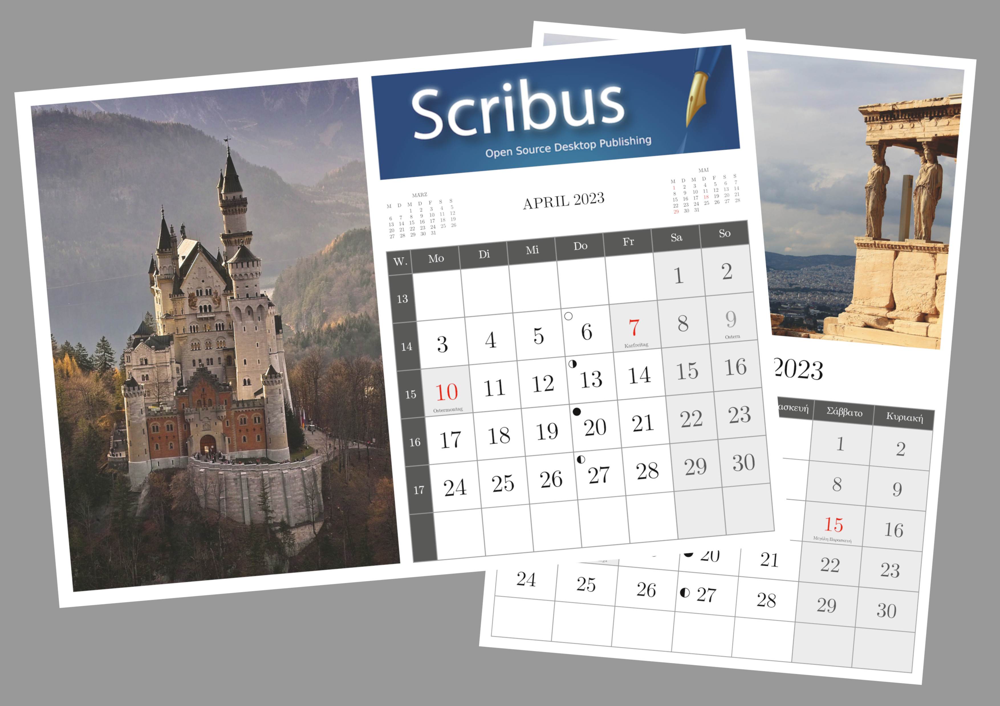

# Monthly-calendar-script-for-Scribus (Works with Scribus 1.5.6+ on Linux and Windows 10)

Script for Scribus in order to generate a calendar in pdf with following options:

1) You can choose between more than 20 languages (default is English).

2) You can choose a font from the list of fonts available on your system. Please check if all special characters for your language are available in the choosen font! You can change fonts afterwards in the Scribus styles menu.

3) Calendar year and week starting day are to be given. Saturdays and Sundays will be printed in grey.

4) Option to show week numbers with (or without) a week numbers heading in your local language. Calendar week numbers will be printed in grey.

5) Option to import holidays and special days from a ‘holidays.txt’ file for your country. See the sample *holidays.txt-files for the layout of the entries. Official holidays will be printed in red.

6) Option to import a ‘moonphases.txt’ file in order to draw the moon phase symbols on the calendar.

7) Select one or more months or the whole year.

8) You have the possibility to determine where on the page the calendar month will be drawn with the offsets from top and / or left margin. Option to draw an empty image frame within the top and / or left ‘offset’ area and to get an ‘inner’ margin between this frame and the calendar grid (see examples below).

9) Option to draw draw mini calendars for previous and next months in the calendar month heading.

10) You can hide the separate layers for grid, moons, holiday texts and images. Use of different styles for month title, weekday names, week numbers, moon phases, holiday texts, mini calendars and dates which can be changed individually. Automatic change to abbreviated weekday names if cells are too small. Many build-in controls.

# Please read the instructions file!

